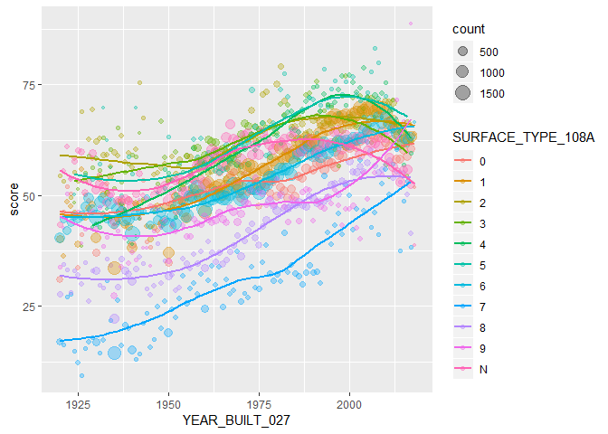

STAT479-HW1
================
HUITONG KOU
2020年2月6日

``` r
#hw1.
library(R.utils)
download.file('https://www.fhwa.dot.gov/bridge/nbi/2018hwybronefiledel.zip',destfile="tmp.zip")
unzip("tmp.zip",files="2018HwyBridgesDelimitedAllStates.txt")
X <- read.csv("2018HwyBridgesDelimitedAllStates.txt")

library(dplyr)
library(ggplot2)
data=select(X,STATE_CODE_001,contains('Year'),contains('Rating'),contains('TYPE'))
data %>% 
  group_by(YEAR_BUILT_027,SURFACE_TYPE_108A) %>% 
  summarise(
    count = n(),
    score=mean(OPERATING_RATING_064,na.rm = T)
  ) %>% 
  filter(count > 5,YEAR_BUILT_027>=1920) %>%
  ggplot( mapping = aes(x = YEAR_BUILT_027, y = score,col=SURFACE_TYPE_108A)) +
  geom_point(aes(size = count), alpha = 1/3) +
  geom_smooth(se = FALSE)
```


